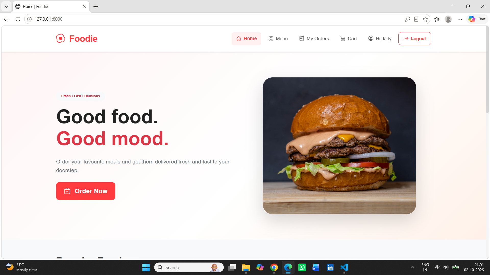
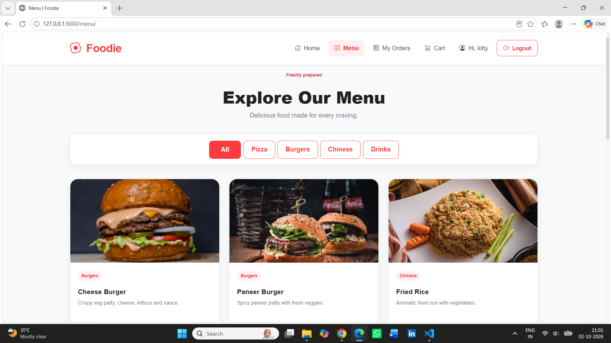
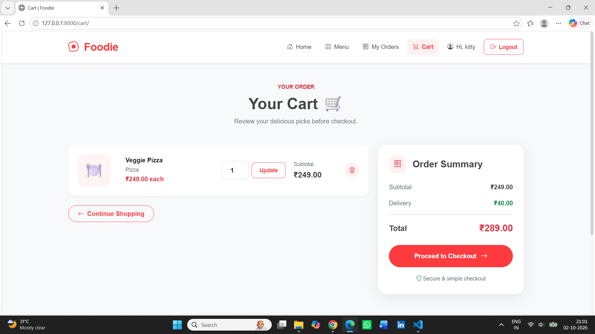
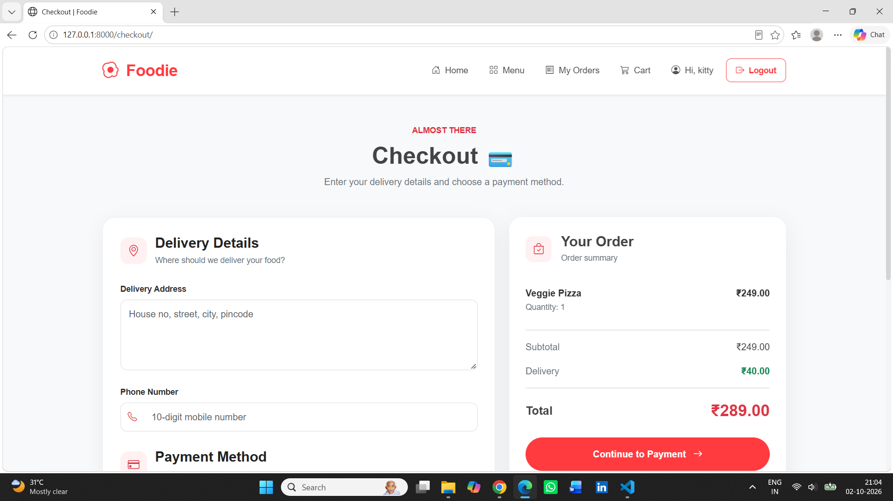
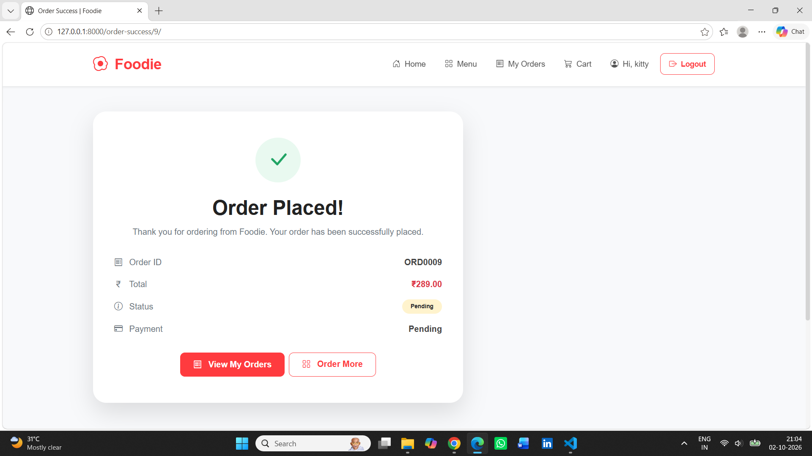
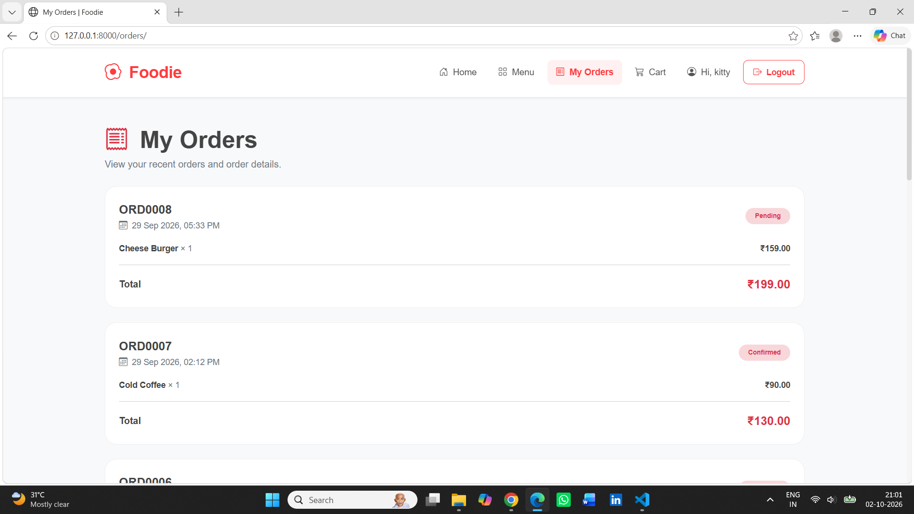
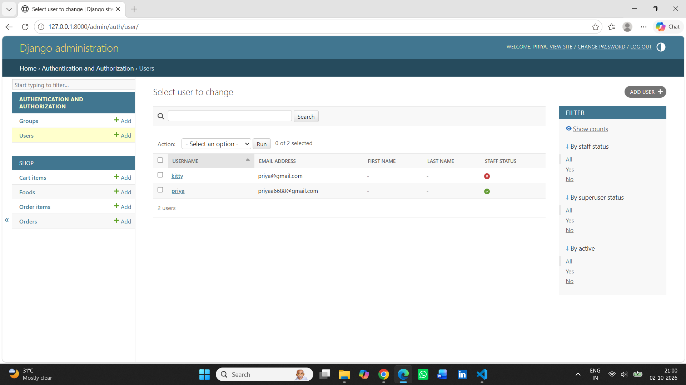

# Foodie

A Django-based Online Food Ordering System designed to provide a complete food ordering experience with user authentication, food browsing, cart management, checkout, demo payment processing, order management, and Django Admin management.

## 🚀 Features

- User registration and authentication
- User login and logout
- Responsive home page
- Food menu with categories
- MySQL-backed food catalogue
- Dynamic food item display
- Add food items to cart
- Update cart item quantities
- Remove cart items
- Checkout and delivery details
- Demo COD/UPI/Card payment flow
- Order creation and management
- Order success page
- My Orders section
- Django Admin for food management
- Django Admin for order management
- Responsive mobile layout
- Database migrations
- Django ORM and database relationships
- Git & GitHub version control

## 📸 Screenshots

### 🏠 Home Page

### 🍔 Food Menu

### 🛒 Shopping Cart

### 📦 Checkout

### 💳 Payment

### 📋 My Orders

### ⚙️ Django Admin

## 🛠️ Technologies Used

- Python
- Django
- HTML5
- CSS3
- Bootstrap
- JavaScript
- MySQL
- Django ORM
- Git & GitHub

## 📂 Project Structure

    Foodie/
    │
    ├── shop/
    │   ├── migrations/
    │   │   ├── 0001_initial.py
    │   │   └── __init__.py
    │   ├── admin.py
    │   ├── apps.py
    │   ├── models.py
    │   └── views.py
    │
    ├── config/
    │   ├── __init__.py
    │   ├── settings.py
    │   ├── urls.py
    │   ├── asgi.py
    │   └── wsgi.py
    │
    ├── templates/
    │   ├── accounts/
    │   │   ├── login.html
    │   │   └── register.html
    │   ├── base.html
    │   ├── home.html
    │   ├── menu.html
    │   ├── cart.html
    │   ├── checkout.html
    │   ├── payment.html
    │   ├── order_success.html
    │   └── orders.html
    │
    ├── static/
    │   ├── css/
    │   │   └── style.css
    │   └── js/
    │       └── script.js
    │
    ├── manage.py
    ├── requirements.txt
    ├── seed_data.py
    ├── datas.sql
    ├── .gitignore
    └── README.md

## ⚙️ Installation

### 1. Clone the Repository

    git clone https://github.com/Priyu-code14/Foodie.git

### 2. Navigate to the Project Folder

    cd Foodie

### 3. Create a Virtual Environment

    py -m venv venv

### 4. Activate the Virtual Environment

For Windows PowerShell:

    venv\Scripts\Activate.ps1

If PowerShell blocks script execution, run:

    Set-ExecutionPolicy -Scope Process -ExecutionPolicy RemoteSigned

Then activate the environment:

    venv\Scripts\Activate.ps1

### 5. Install Required Packages

    pip install -r requirements.txt

### 6. Configure Environment Variables

Create a `.env` file in the project root.

Example:

    SECRET_KEY=your-secret-key
    DEBUG=True

    DB_NAME=foodie
    DB_USER=root
    DB_PASSWORD=your-mysql-password
    DB_HOST=127.0.0.1
    DB_PORT=3306

Keep the `.env` file private and do not commit it to GitHub.

### 7. Create the MySQL Database

Open MySQL:

    mysql -u root -p

Create the database:

    CREATE DATABASE foodie;

Check the database:

    SHOW DATABASES;

Exit MySQL:

    exit;

### 8. Configure the Database

Foodie uses MySQL as its primary database.

The Django application reads the database configuration from the `.env` file.

Database configuration:

- Database Engine: MySQL
- Database Name: foodie
- Database User: root
- Database Host: 127.0.0.1
- Database Port: 3306

### 9. Apply Database Migrations

    py manage.py makemigrations

    py manage.py migrate

### 10. Create an Admin Account

    py manage.py createsuperuser

Enter the requested username, email, and password.

### 11. Add Sample Food Data

    py seed_data.py

This loads sample food data into the database.

### 12. Run the Development Server

    py manage.py runserver

Open the application at:

    http://127.0.0.1:8000/

Admin:

    http://127.0.0.1:8000/admin/

## 🧪 Project Verification

Run Django's system check:

    py manage.py check

Expected result:

    System check identified no issues (0 silenced).

Check applied migrations:

    py manage.py showmigrations

Check for model changes:

    py manage.py makemigrations --check

Check Git status:

    git status

## 🎯 Project Objective

The objective of Foodie is to provide a complete online food ordering platform where users can browse food items, manage their shopping cart, provide delivery details, complete a simulated payment process, place orders, and view their order history.

The project demonstrates how a real-world food ordering workflow can be implemented using Django, MySQL, HTML, CSS, Bootstrap, and JavaScript.

## 🔄 How Foodie Works

1. User creates an account and logs into the application.
2. User browses available food items through the menu.
3. Food items are displayed using different categories.
4. User selects food items and adds them to the cart.
5. User can increase or decrease item quantities.
6. User can remove unwanted items from the cart.
7. User proceeds to checkout.
8. User provides delivery details.
9. User selects a demo payment method.
10. The application processes the simulated payment workflow.
11. The order is created and stored in the MySQL database.
12. User is redirected to the order success page.
13. User can view previous orders through My Orders.
14. Admin can manage food items and orders through Django Admin.

## 💡 Technical Highlights

This project demonstrates practical experience with:

- Django MVT architecture
- Django ORM
- MySQL database integration
- Relational database design
- Model relationships
- CRUD operations
- User authentication
- User registration and login
- Session management
- Shopping cart functionality
- Cart quantity management
- Order management
- Checkout workflow
- Payment workflow simulation
- Django forms and validation
- URL routing
- Template inheritance
- Dynamic templates
- Database migrations
- Static files
- Bootstrap responsive design
- JavaScript interactions
- Environment variable configuration
- Git version control
- GitHub repository management

## 📊 Main Modules

### 👤 Accounts

- User registration
- User login
- User logout
- Django authentication
- Session management
- User-specific order access

### 🍔 Food Menu

- Display food items
- Food categories
- Food descriptions
- Food prices
- MySQL-backed food catalogue
- Dynamic menu rendering

### 🛒 Shopping Cart

- Add food items to cart
- Increase item quantity
- Decrease item quantity
- Remove items from cart
- Calculate item totals
- Calculate cart total
- Maintain cart using session data

### 📦 Checkout

- Display selected food items
- Calculate order total
- Collect delivery details
- Validate checkout information
- Proceed to payment

### 💳 Payment

- Demo payment workflow
- Cash on Delivery option
- UPI option
- Card option
- Simulated payment processing
- Order confirmation after payment

> Payment functionality is intentionally simulated for portfolio and demonstration purposes. No real payment gateway or financial transaction is processed.

### 📋 Orders

- Create orders
- Store order details
- Store ordered food items
- View order history
- Display order information
- Order success confirmation

### ⚙️ Django Admin

- Manage food items
- Manage food categories
- Manage orders
- Manage order items
- View registered users
- Manage application data through Django Admin

## 🗄️ Database

Foodie uses MySQL as the primary relational database.

The database stores application data such as:

- User information
- Food items
- Food categories
- Cart information
- Orders
- Order items
- Delivery details
- Payment-related order information

Django ORM is used to interact with the MySQL database for normal application operations.

Database migrations are managed using Django's migration system.

## 🔐 Security

The project includes:

- Django authentication
- CSRF protection
- Password handling through Django authentication
- Environment variable configuration
- `.env` protection through `.gitignore`
- User-specific order access
- Django session management

Sensitive database credentials are stored in the `.env` file and are not committed to GitHub.

## 📱 Responsive Design

Foodie includes responsive layouts for:

- Desktop
- Laptop
- Tablet
- Mobile devices

Bootstrap and custom CSS are used to create responsive layouts and improve the user experience across different screen sizes.

## 📚 What I Learned

Through Foodie, I gained hands-on experience in developing a full-stack Django web application and implementing a complete food ordering workflow.

Key learning areas include:

- Building a Django web application
- Creating Django models
- Designing relational database structures
- Connecting Django with MySQL
- Using Django ORM
- Implementing authentication
- Managing user sessions
- Building shopping cart functionality
- Implementing checkout workflows
- Creating order management functionality
- Handling database migrations
- Working with Django templates
- Using Bootstrap for responsive interfaces
- Adding JavaScript interactions
- Managing environment variables
- Using Git and GitHub for version control

## 🔮 Future Enhancements

- Real payment gateway integration
- Online payment verification
- Food search functionality
- Advanced food filtering
- Restaurant management
- Food ratings and reviews
- Wishlist functionality
- Order status tracking
- Email order notifications
- User profile management
- Coupon and discount system
- Delivery tracking
- REST API development
- Automated testing
- Production deployment
- Cloud database integration

## 📌 Project Status

**Status: Completed Core Development**

Current modules and features include:

- User Authentication
- Food Menu
- Food Categories
- Shopping Cart
- Checkout
- Demo Payment
- Order Management
- My Orders
- Django Admin
- MySQL Database
- Responsive UI
- Git & GitHub Integration

## 🔗 Repository

**GitHub:**  
https://github.com/Priyu-code14/Foodie

## 👩‍💻 Author

**Priyadharshini**

Python Full Stack Developer

GitHub:  
https://github.com/Priyu-code14